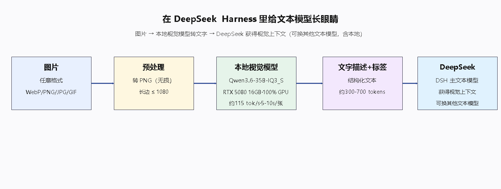
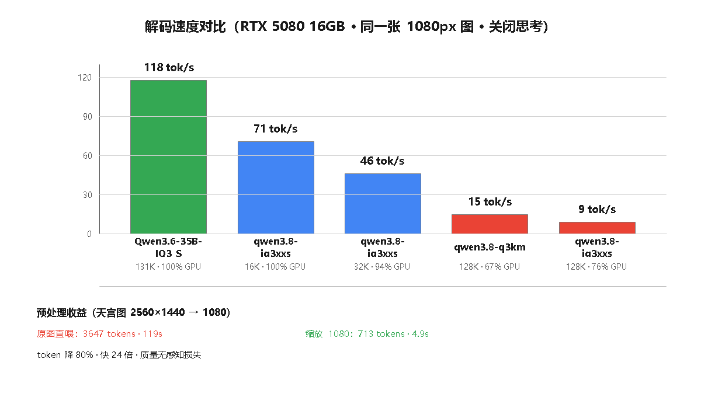

<div align="center">

# 👁️ 给 DeepSeek 装眼睛 · DeepSeek Harness 技能库

**给 DeepSeek 装上一双"眼睛"的 Agent Skill —— 让 DSH 里的文本模型看得见图片。**

给文本模型长眼睛：为 [DeepSeek Harness（DSH）](https://github.com/deepseek-ai/deepseek-harness) 自研的 Agent Skills，按 [Agent Skills 标准](https://agentskills.io) 组织。

**English**：[README.md](README.md) · English README

**DSH 生态关联** · [DeepSeek Harness](https://github.com/deepseek-ai/deepseek-harness) · 主题 [`dsh-plugin`](https://github.com/topics/dsh-plugin) · [Agent Skills](https://agentskills.io)

---

> **图片 → 视觉模型转成文字 → 文本模型"看见"**

[**deepseek-eyes**](skills/Supermate/Deepseek-eyes/) 在 DeepSeek Harness 里给 DeepSeek（或任意文本模型）装上一双"眼睛"——截图、照片、插画、角色设定图、AI 生成图，统统变成模型能理解的结构化文字。

</div>

---

## ⚙️ 工作原理

本 Skill 通过调用**本地视觉模型（Ollama）**或 **OpenAI 兼容视觉 API**，把图片与图形文件——截图、照片、图表、设计稿、插画、角色设定图、AI 生成图——转换成结构化文字。DeepSeek 读到这些文字，就相当于"读"懂了图片和图形文件。

```text
图片 / 图形文件 → Skill → 本地视觉模型或视觉 API → 结构化文字 → DeepSeek 阅读与推理
```

---

## ✨ 技能清单

| 技能 | 功能 | 文档 |
|---|---|---|
| [**deepseek-eyes**](skills/Supermate/Deepseek-eyes/) | 协助文本 AI 模型做图片分析：图片 → 结构化中文描述 + 检索标签（本地 Ollama 或 OpenAI 兼容视觉 API） | [中文](skills/Supermate/Deepseek-eyes/README-cn.md) · [English](skills/Supermate/Deepseek-eyes/README-en.md) |

### 架构



### 实测数据（RTX 5080 16GB）



---

## 🔗 与 DeepSeek Harness 的关联

本仓库属于 **DeepSeek Harness 插件生态**：在 GitHub 主题 [`dsh-plugin`](https://github.com/topics/dsh-plugin) 下可以找到本仓库，也能找到 [DeepSeek Harness](https://github.com/deepseek-ai/deepseek-harness) 本身。把技能文件夹放进 `~/.dsh/skills/`，DSH 代理遇到图片就会自动"睁眼"，把图片描述注入文本模型的上下文。

## 🚀 安装到 DSH

把技能文件夹放进 DSH 技能目录：

```text
~/.dsh/skills/deepseek-eyes/
```

重启 DSH 会话——代理遇到图片会自动"睁眼"，把图片描述注入文本模型的上下文。

## ✅ 前提（使用 deepseek-eyes 时）

1. **本地视觉模型**：[Ollama](https://ollama.com) + `ollama pull llava:13b`（或任意 vision 模型）
2. 或 **OpenAI 兼容视觉 API** + API Key

---

<div align="center">

*给 DeepSeek 装眼睛 · 为 DeepSeek Harness 生态而建（主题 [`dsh-plugin`](https://github.com/topics/dsh-plugin)）*

</div>
