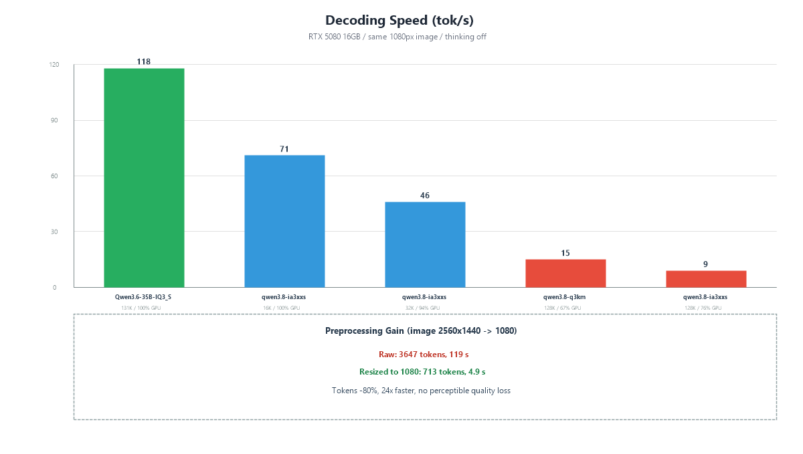

<div align="center">

# 👁️ Give DeepSeek Eyes

**Give text models eyes — a [DeepSeek Harness (DSH)](https://github.com/deepseek-ai/deepseek-harness) Skill that lets DeepSeek read images and graphic files.**

The Skill calls a **local vision model (Ollama)** or an **OpenAI-compatible vision API** to convert images and graphic files into structured text, so DeepSeek can read and reason about them. Organized per the [Agent Skills standard](https://agentskills.io).

**中文版**：[README-cn.md](README-cn.md) · 中文说明

**DSH Ecosystem** · [DeepSeek Harness](https://github.com/deepseek-ai/deepseek-harness) · topic [`dsh-plugin`](https://github.com/topics/dsh-plugin) · [Agent Skills](https://agentskills.io)

---

> **Image → vision model converts it to text → the text model "sees"**

[**image-analysis**](skills/image-analysis/) gives DeepSeek (or any text model) a pair of eyes inside DeepSeek Harness — screenshots, photos, charts, design drafts, illustrations, character sheets, AI-generated images all become structured text the model can reason about.

</div>

---

## ⚙️ How it works

The Skill calls a **local vision model (Ollama)** or an **OpenAI-compatible vision API** to convert images and graphic files — screenshots, photos, charts, design drafts, illustrations, character sheets, AI-generated images — into structured text. DeepSeek then reads that text, which is exactly how it gains the ability to "read" images and graphic files.

```text
Image / graphic file → Skill → local vision model or vision API → structured text → DeepSeek reads & reasons
```

---

## ✨ The Skill

| Skill | What it does | Manuals |
|---|---|---|
| [**image-analysis**](skills/image-analysis/) | Image → structured description + retrieval tags. Local Ollama or OpenAI-compatible vision API. | [English](skills/image-analysis/README-en.md) · [中文](skills/image-analysis/README-cn.md) |

### Architecture


### Measured performance (RTX 5080 16GB)



---

## 🔗 DeepSeek Harness Ecosystem

This repository is part of the **DeepSeek Harness plugin ecosystem** — find it under the [`dsh-plugin`](https://github.com/topics/dsh-plugin) topic, alongside [DeepSeek Harness](https://github.com/deepseek-ai/deepseek-harness) itself. Drop a skill folder into `~/.dsh/skills/`, and the DSH agent automatically "opens its eyes" whenever it meets an image, injecting the image description into the text model's context.

## 🚀 Install into DSH

Put the skill folder into DSH's skill directory:

```text
~/.dsh/skills/image-analysis/
```

Restart the DSH session — the agent automatically "opens its eyes" when it meets an image, and injects the image description into the text model's context.

## ✅ Prerequisites (for image-analysis)

1. **Local vision model**: [Ollama](https://ollama.com) + `ollama pull llava:13b` (or any vision model)
2. or **OpenAI-compatible vision API** + API key

---

<div align="center">

*Give DeepSeek Eyes · Built for the DeepSeek Harness (DSH) ecosystem — topic [`dsh-plugin`](https://github.com/topics/dsh-plugin)*

</div>
