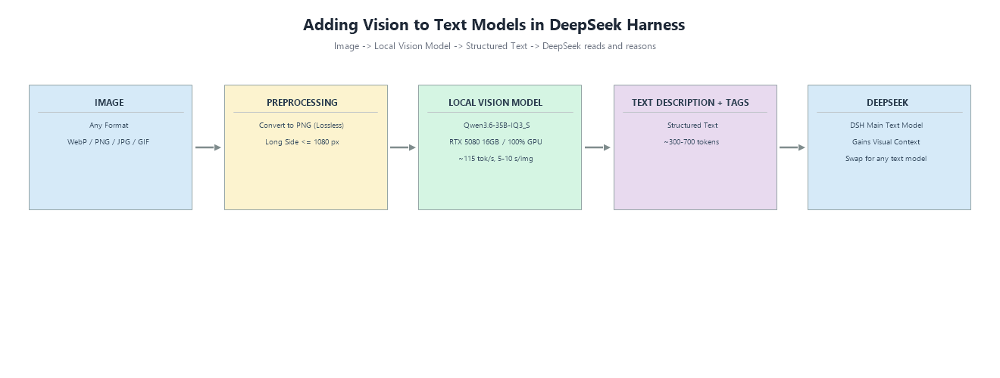

<div align="center">

# 👁️ Give DeepSeek Eyes

[](LICENSE)

**Give text models eyes — a [DeepSeek Harness (DSH)](https://github.com/deepseek-ai/deepseek-harness) Skill that lets DeepSeek read images and graphic files.**

The Skill calls a **local vision model (Ollama)** or an **OpenAI-compatible vision API** to convert images and graphic files into structured text, so DeepSeek can read and reason about them. Organized per the [Agent Skills standard](https://agentskills.io).

**中文版**：[README-cn.md](README-cn.md) · 中文说明

**DSH Ecosystem** · [DeepSeek Harness](https://github.com/deepseek-ai/deepseek-harness) · topic [`dsh-plugin`](https://github.com/topics/dsh-plugin) · [Agent Skills](https://agentskills.io)

**License** · [Apache-2.0](LICENSE)（含专利授权条款）· 双许可边界见 [双许可说明](双许可说明.md)（核心闭源商业层：调度/记忆治理/沙箱/评测）

---

## 🧩 SuperMate Harness System · 系统仓库

本仓库是 **SuperMate Harness System**（天人合一：云端灵感 + 本地可控 + 本地/云端工具统一应用），结构：

```
SuperMate Harness System
 ├── skills/Supermate/   → Skill 层（任务级）
 │    ├── Deepseek-eyes/          视觉 skill（Ollama）
 │    ├── MiniMax h3-video-producer/  本地完整视频生产
 │    ├── SKILL.md                 智能体身份（能力矩阵/插件调用协议/复盘模板）
 │    └── DSH Official/           官方基础技能（deepseek-ai，13 个，只选官方）
 └── plugins/           → 插件层（系统级）
      ├── Supermate/             自研插件（规划中，核心增强闭源商业层）
      ├── DSH Official/          官方基本插件索引（deepseek-ai）
      └── README.md              插件清单（模型/记忆/调度/工具/沙箱/评测/UI）
```

### Skill 层 · [skills/](skills/)

| Skill | 能力 |
|-------|------|
| [**deepseek-eyes**](skills/Supermate/Deepseek-eyes/) | 给文本模型长眼睛（Ollama 视觉） |
| [**h3-video-producer**](skills/Supermate/MiniMax h3-video-producer/) | 本地 H3 完整视频生产（三模式/链式/合成） |
| [**supermate**](skills/Supermate/) | 基于 DSH 插件结构的真智能体（身份+能力矩阵+复盘） |

### 插件层 · [plugins/](plugins/)

模型适配 / 记忆 / 调度 / 工具 / 沙箱 / 评测 / UI —— 详见 [plugins/README.md](plugins/README.md)。核心闭源商业层（高级调度/记忆治理/沙箱/评测实现）见《双许可说明.md》。

---

> **Image → vision model converts it to text → the text model "sees"**

[**deepseek-eyes**](skills/Supermate/Deepseek-eyes/) gives DeepSeek (or any text model) a pair of eyes inside DeepSeek Harness — screenshots, photos, charts, design drafts, illustrations, character sheets, AI-generated images all become structured text the model can reason about.

</div>

---

## ⚙️ How it works

The Skill calls a **local vision model (Ollama)** or an **OpenAI-compatible vision API** to convert images and graphic files — screenshots, photos, charts, design drafts, illustrations, character sheets, AI-generated images — into structured text. DeepSeek then reads that text, which is exactly how it gains the ability to "read" images and graphic files.

```text
Image / graphic file → Skill → local vision model or vision API → structured text → DeepSeek reads & reasons
```

---

## ✨ The Skill

| Skill | What it does | Manuals |
|---|---|---|
| [**deepseek-eyes**](skills/Supermate/Deepseek-eyes/) | Image analysis for text AI models: image → structured description + retrieval tags. Local Ollama or OpenAI-compatible vision API. | [English](skills/Supermate/Deepseek-eyes/README-en.md) · [中文](skills/Supermate/Deepseek-eyes/README-cn.md) |

### Architecture



### Measured performance (RTX 5080 16GB)


---

## 🔗 DeepSeek Harness Ecosystem

This repository is part of the **DeepSeek Harness plugin ecosystem** — find it under the [`dsh-plugin`](https://github.com/topics/dsh-plugin) topic, alongside [DeepSeek Harness](https://github.com/deepseek-ai/deepseek-harness) itself. Drop a skill folder into `~/.dsh/skills/`, and the DSH agent automatically "opens its eyes" whenever it meets an image, injecting the image description into the text model's context.

## 🚀 Install into DSH

Put the skill folder into DSH's skill directory:

```text
~/.dsh/skills/deepseek-eyes/
```

Restart the DSH session — the agent automatically "opens its eyes" when it meets an image, and injects the image description into the text model's context.

## ✅ Prerequisites (for deepseek-eyes)

1. **Local vision model**: [Ollama](https://ollama.com) + `ollama pull llava:13b` (or any vision model)
2. or **OpenAI-compatible vision API** + API key

---

<div align="center">

*Give DeepSeek Eyes · Built for the DeepSeek Harness (DSH) ecosystem — topic [`dsh-plugin`](https://github.com/topics/dsh-plugin)*

</div>
