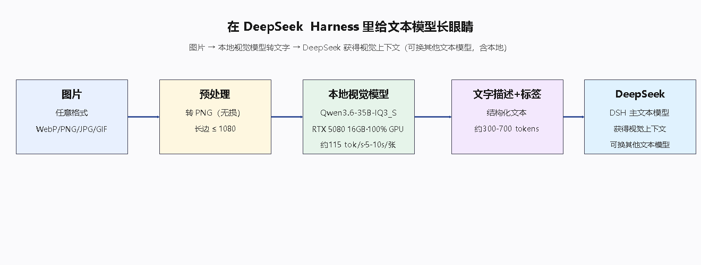

# image-analysis-skill

## 主题：给 DeepSeek Harness 里的文本模型长眼睛

[DeepSeek Harness（DSH）](https://github.com/deepseek-ai/deepseek-harness) 是 [DeepSeek AI](https://deepseek.com) 开源的智能体框架（一切皆插件）。DSH 里的文本模型——默认是 **DeepSeek**——只能读文字，**看不到图片**，这是它最大的能力缺口。

**本技能就是 DSH 的一个技能（Skill），专门补上这个缺口**：给 DSH 里的 DeepSeek 装上一双"眼睛"。

> **图片 → 视觉模型转成文字 → DeepSeek"看见"了**



装上本技能后，DSH 代理遇到图片（截图、照片、插画、角色设定图、AI 生成图……）会自动"睁眼"：本地视觉模型把图片翻译成**结构化文字描述 + 检索标签**，注入 DeepSeek 的上下文，DeepSeek 就能基于图片内容理解、推理、回答。

> DSH 里的文本模型不限于 DeepSeek——可以换成其他文本模型（包括本地部署的）。"眼睛"是通用的，谁用它，谁就获得视觉能力。

## 在 DeepSeek Harness 里安装

把 `image-analysis` 文件夹放进 DSH 的技能目录：

```text
~/.dsh/skills/image-analysis/
```

重启 DSH 会话，技能即被代理识别并自动启用。

## 在 DeepSeek Harness 里使用

**自动模式（推荐）**：DSH 代理在以下任务中自动"睁眼"，无需手动操作——

- 资产入库（把图片转成文字描述 + 标签存档）
- 提示词管理（看图写提示词 / 管理图片素材）
- 截图理解（DSH 对话中分析你贴的图）
- 图片对比（让 DeepSeek 对比两张图的内容）

**手动模式**：在 DSH 环境里直接跑脚本，把输出粘进对话：

```powershell
# 本地"眼睛"（Ollama + 视觉模型，默认 llava:13b）
.\image-analysis.ps1 -ImagePath "D:\pics\photo.webp"

# 云端"眼睛"（OpenAI 兼容视觉 API，如 gpt-4o / qwen-vl）
$env:VISION_API_KEY = "sk-..."
.\image-analysis.ps1 -ImagePath "D:\pics\photo.png" -Provider openai -Model "gpt-4o-mini"
```

输出示例（直接注入 DeepSeek 上下文）：

```text
这是一张角色设定图……（结构化描述）
检索标签：HARUMIN, 角色设定图, 橙黄条纹泳装, 银色创可贴, 短发女性角色, 声线描述
```

**脚本自动预处理**：任意格式（WebP 等）转 PNG、长边缩放到 1080——大图直接喂会又慢又糊（token 爆炸），缩放后"眼睛"读得更清、更快、更省。

## 配置（在 DSH 环境里生效）

| 参数 | 默认 | 说明 |
|---|---|---|
| `-Provider` | `local` | `local`（Ollama）/ `openai`（兼容 API） |
| `-Model` | `llava:13b` | 视觉模型（这双"眼睛"） |
| `-Endpoint` | `http://127.0.0.1:11434` | 服务地址 |
| `-ApiKey` | 空 | 仅 `openai` 需要（或用 `$env:VISION_API_KEY`） |
| `-MaxEdge` | `1080` | 图片长边缩放上限（px） |

环境变量（`VISION_MODEL` / `VISION_ENDPOINT` / `VISION_API_KEY` / `VISION_PROVIDER`）可在 DSH 启动环境中统一配置。

## 这双"眼睛"好不好用（DSH 本地视觉搭档 · 5080 16GB 实测）

- 读一张图 **5~10 秒**，产出 **300~700 tokens** 文字描述；
- 本地视觉前端 `Qwen3.6-35B-IQ3_S`：**100% GPU、118 tok/s**（唯一满速选项）；
- 预处理收益：大图 token 从 **3647 降到 713**（降 80%），快 24 倍，质量无损失。


## 前提（二选一）

1. **本地视觉模型**：安装 [Ollama](https://ollama.com) 并 `ollama pull llava:13b`（或任意 vision 模型）；
2. **OpenAI 兼容视觉 API**：任意服务商 + API Key。

---

实现细节、全部参数与常见问题见 `SKILL.md` 与 `image-analysis.ps1`。
